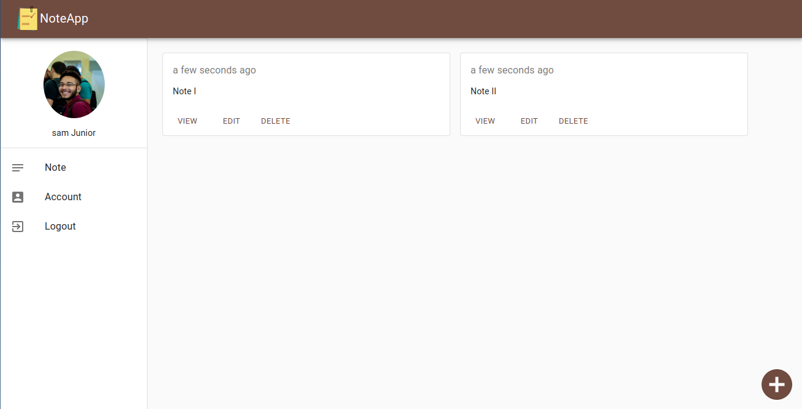
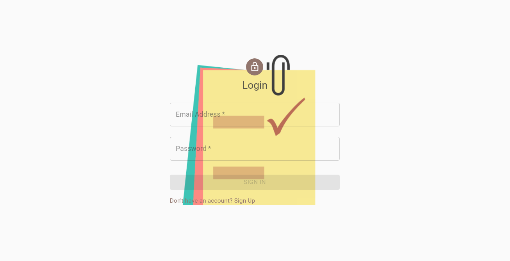
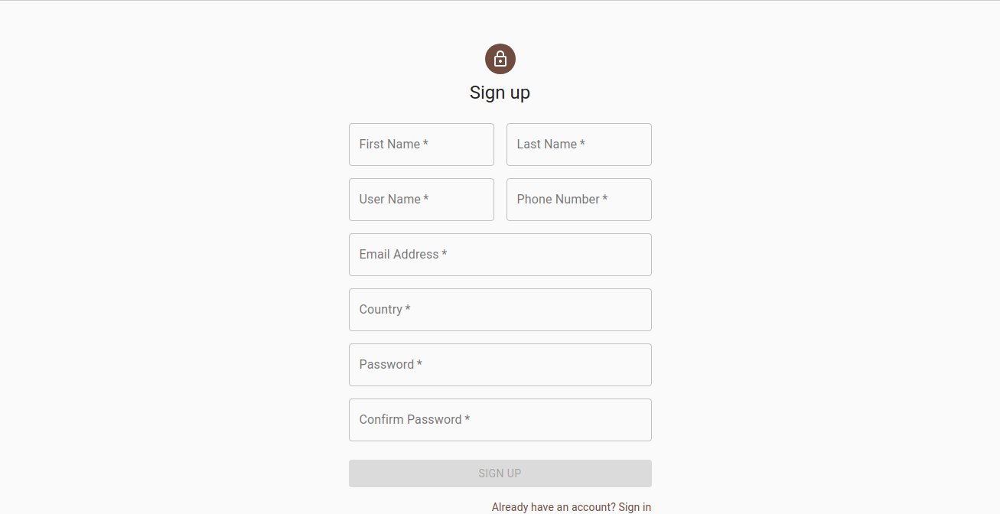
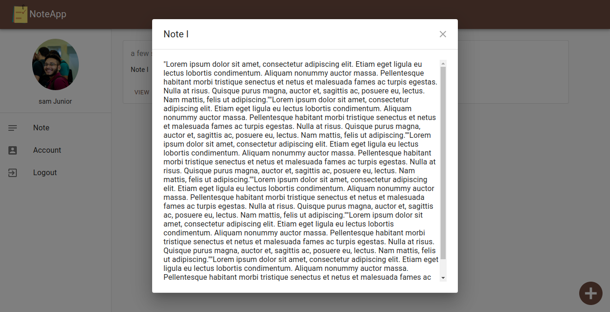
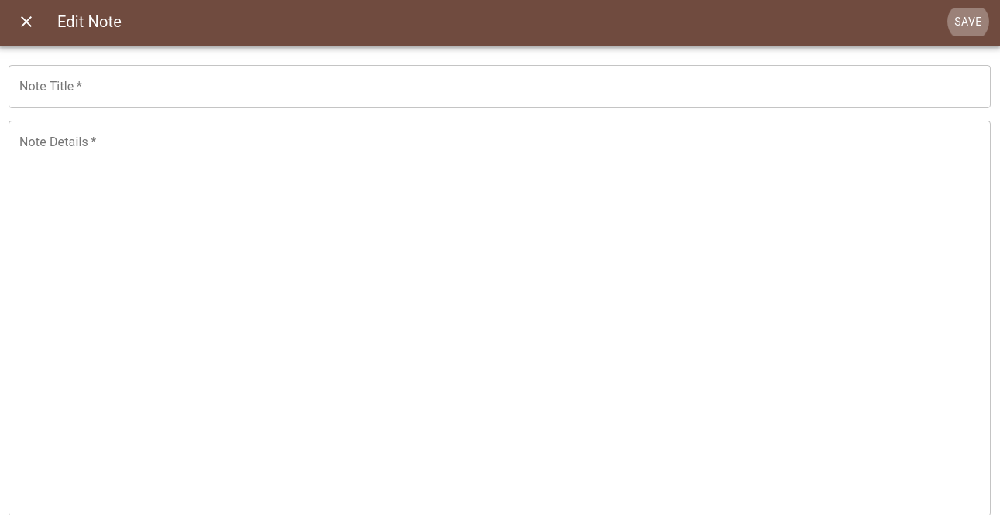
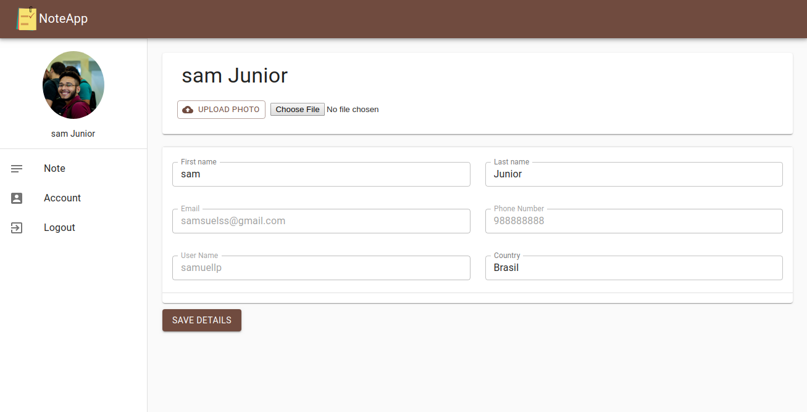

<h1 align="center">
  
</h1>

<br />

## 💻 Projeto


<strong>NotesApp<strong> is a project for help people to remember to do all yours activities. API built with Firebase and express, and the Front-end made in ReactJS and MaterialUI.

<br />

## 🌐 Web

<h1 align="center">
	<h2>Login Page</h2>    
	
	<h2>SignUp Page</h2>	
	
	<h2>View Note Page</h2>	
	
	<h2>Edit Note Page</h2>	
	
	<h2>Account Page</h2>	
	
</h1>

<br />

## 🚀 Techs

This project was developed with the following technologies:

- [Firebase](https://firebase.google.com/?hl=pt-br)
	- Firestore: Database	
	- Authentication: User Authentication
	- Storage: Files Database
- [Express](https://expressjs.com/pt-br/)
- [React](https://reactjs.org)
- [Material UI](https://material-ui.com/)
- [Joi](https://github.com/hapijs/joi)
- [Insomnia](https://insomnia.rest/)

<br />

## 🔥 Install

```bash
# Clone this rep
$ git clone https://github.com/samueljrz/NotesApp

# After, enter the web folder and execute the comands:
$ npm
$ npm start
```
